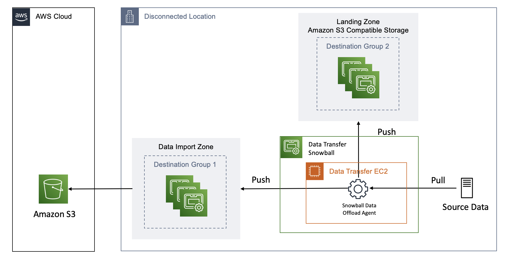
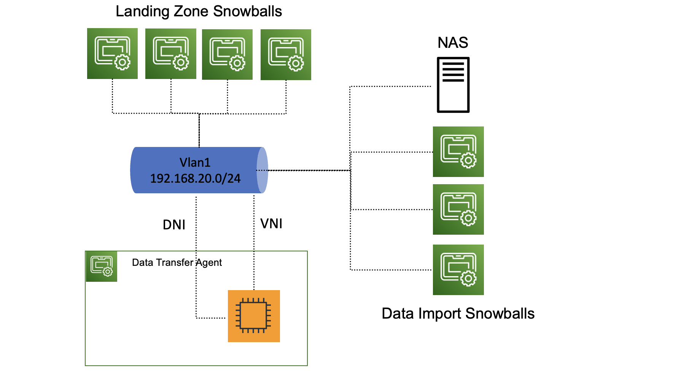

# SnowballDataOffload
## Table of Contents

- [Disclaimer](#disclaimer)
- [Solution Overview](#solution-overview)
- [Architecture Diagram](#architecture-diagram)

- [Installation](#installation)
  - [Prerequisites](#prerequisites)
  - [Setup Snowball Data Offload Agent](#setup-snowball-data-offload-agent)
  - [Edit config.json for your environment](#edit-config.json-for-your-environment)

- [Run](#run)
# Disclaimer
Sample code, software libraries, command line tools, proofs of concept, templates, or other related technology are provided as AWS Content or Third-Party Content under the AWS Customer Agreement, or the relevant written agreement between you and AWS (whichever applies). You should not use this AWS Content or Third-Party Content in your production accounts, or on production or other critical data. You are responsible for testing, securing, and optimizing the AWS Content or Third-Party Content, such as sample code, as appropriate for production grade use based on your specific quality control practices and standards. Deploying AWS Content or Third-Party Content may incur AWS charges for creating or using AWS chargeable resources, such as running Amazon EC2 instances or using Amazon S3 storage.

Security is a top priority at AWS. Carefully consider security when deploying this solution. Please see also Snowball Edge Developer Guide [Security for AWS Snowball Edge](https://docs.aws.amazon.com/snowball/latest/developer-guide/security.html) and [Best Practices for Security] (https://docs.aws.amazon.com/snowball/latest/developer-guide/best-practice-security.html)

# Solution Overview
This Snowball Data Offload agent is intended to allow users to durably and efficiently offload data from on-prem network attached storage (NAS).  AWS Snowball Edge data import jobs allow users to transfer large amounts of data to the AWS Cloud.  However, AWS recommends customers keep a copy of their data on-premises in case the AWS Snowball Edge is lost or damaged in transit.  This data offload agent was intended to solve for the use case that customer needed a "landing zone" to durably store petabytes of data while the data import jobs were in transit to AWS.  This Snowball Data Offload agent automates the process of pulling the data from the source NAS system and ensuring that all data is replicated to the Amazon S3 compatible storage cluster and the data import snowball.  The agent will automatically identify files that need to be copied and use s5cmd to faciliate parallel transfers

# Architecture Diagram



# Installation

## Prerequisites

### Setup Amazon Linux 2 EC Instance
This EC2 instance will host the snowball data offload agent.
- [Create EC2 instance from OpsHub](https://docs.aws.amazon.com/snowball/latest/snowcone-guide/manage-ec2.html).  Use "sbe-c.4xlarge" as the instance type in order to allow s5cmd to leverage 20 workers and fully utilize the CPU's.
- [Configure security group](https://docs.aws.amazon.com/snowball/latest/developer-guide/using-ec2-endpoint.html#list-cli-commands-ec2-edge) for least privilege on the EC2 instance.  EC2 instance only requires port 22 inbound to access the shell.
- Install go - sudo yum install go
- Enable EPEL Repository - sudo amazon-linux-extras install epel -y
- Install s5cmd - go install github.com/peak/s5cmd/v2@master
- [Upgrade AWS CLI to v2](https://docs.aws.amazon.com/cli/latest/userguide/getting-started-install.html#getting-started-install-instructions)
- Copy snowball manifest files to /home/ec2-user/creds/
- Install snowballedge client https://aws.amazon.com/snowball/resources/
- [Setup snowball edge client profiles](https://docs.aws.amazon.com/snowball/latest/developer-guide/using-client-commands.html#client-configuration) for all cluster snowballs and data import snowball
- [Export access keys](https://docs.aws.amazon.com/snowball/latest/developer-guide/using-client-commands.html#client-credentials) and [certificates](https://docs.aws.amazon.com/snowball/latest/developer-guide/using-client-commands.html#snowball-edge-certificates-cli)from cluster and data import snowballs and store in /home/ec2-user/creds/
- [Setup AWS profiles](https://docs.aws.amazon.com/snowball/latest/developer-guide/using-adapter.html#using-adapter-cli-specify-region) for each of the cluster snowballs and the data import snowball
- [Setup a Direct Network Interface (DNI) for this EC Instance](https://docs.aws.amazon.com/snowball/latest/developer-guide/network-config-ec2.html#snowcone-setup-dni).  It is very important to setup a DNI and ensure that all communications between the data offload agent and the NAS and other snowballs uses the DNI otherwise you will not get the best performance possible.  The easiest way to do this is to put the DNI on the same subnet as the NAS and other snowballs.

## Setup Snowball Data Offload Agent
```bash
git clone git@ssh.gitlab.aws.dev:wwps-us-dod-army-sa/snowballdataoffload.git
pip3 install -r requirements.txt
```

## Edit config.json for your environment
This configuration file is passed to main.py and describes how and where to copy the source data.  Valid parameters are:
- log_level: controls log verbosity.  Valid values are debug, info, notice, warning, err, crit, alert, emerg
- num_workers: sets the size of the global worker for each destination
- reporting_frequency: how often the script produces a progress report in seconds
- source: directory containing the files that need to be offloaded
- destinations: JSON object that describes target copy groups
  - {groupx}: JSON object with arbitrary name that describes one or more Snowball Edge devices.  Each group receives a copy of the data in parrallel
    - type: Describes the S3 interface for the target Snowball Edge devices.  Valid values are s3adapter or s3compatible.  See [Amazon S3 Compatible Storage on AWS Snowball Edge Compute Optimized Devices Now Generally Available](https://aws.amazon.com/blogs/aws/amazon-s3-compatible-storage-on-aws-snowball-edge-compute-optimized-devices-now-generally-available/) for more information on the differences.
    - snowballs: Array of snowball edge devices that comprise the group
      - bucket: The target S3 bucket name.  This value must be consistent for all devices in a s3compatible groups.
      - endpoint: Url for S3 service.  Note that S3compatible has a dedicated S3 API that runs on 443 while s3adapter runs on 8443.
      - profile: Name of the AWS profile containing credentials for the S3 service.  See [Configuration and credential file settings](https://docs.aws.amazon.com/cli/latest/userguide/cli-configure-files.html) for more information.
      - name: Human readable name  

See included config.json file as an example.

# Run
```bash
export PATH="$HOME/go/bin:$PATH"
export AWS_REGION='snow'
python3 main.py --config_file config.json
```
